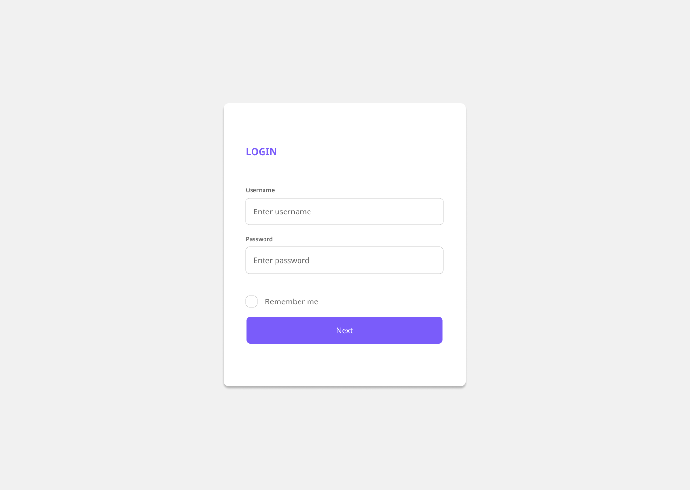

#Desenvolvedor Web

Queremos ver suas incríveis habilidades de desenvolvimento, fique a vontade para consultar cursos, documentos e links compartilhados neste documento:

### Passos para seguir

* Confira o design do login no [Figma](https://www.figma.com/file/b0qNj9YWkakKR3LFJktB7m/Praticando?node-id=0%3A1).

* Siga o a página de login a baixo para o desafio de hoje.
  
  
* Utilize HTML5, CSS e Java Script, para desenvolver as páginas. É importante não utilizar nenhum framework no momento. 

* Este projeto terá várias etapas, então não se preocupe com conceitos não aplicados nessa etapa, iremos trabalhar vários deles.

### Quando você acabar
Me chame para revisarmos o código e começarmos um novo desafio

#### Mal podemos esperar para ver o seu trabalho!
 
